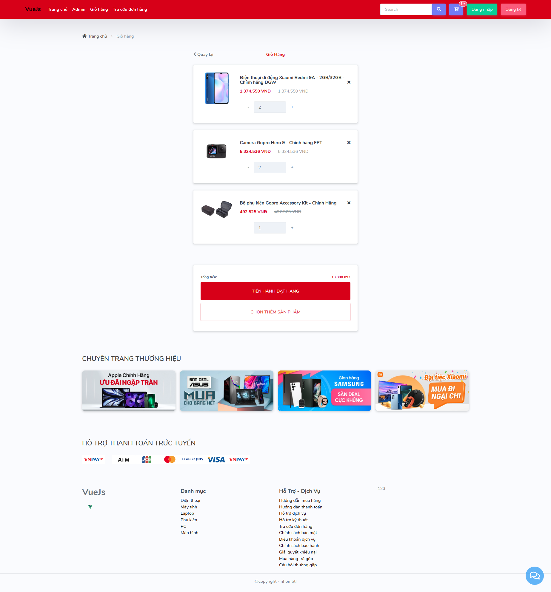
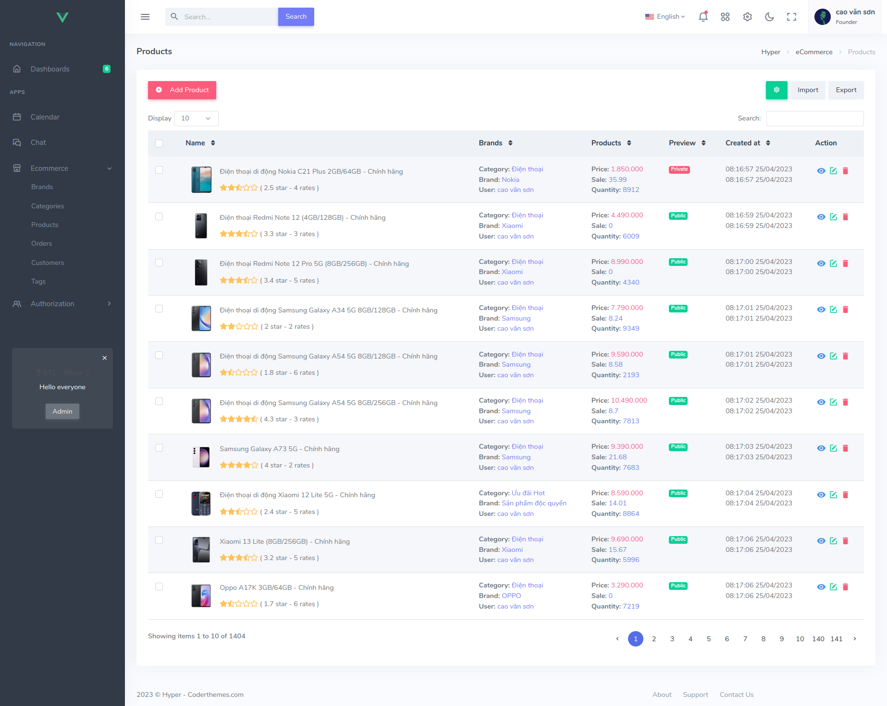
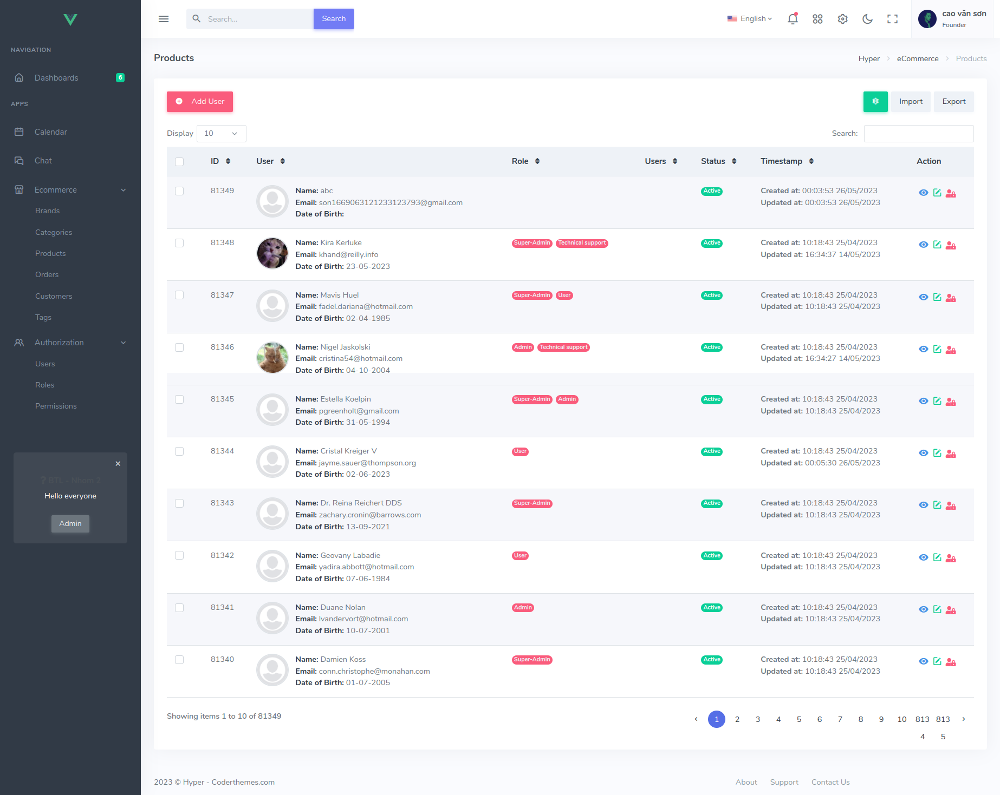
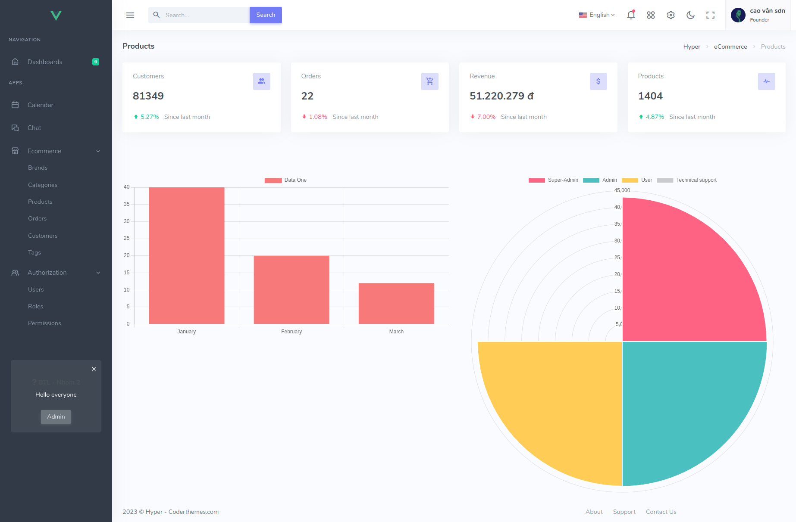

# vue-project

## Project Setup

```sh
npm install

```

## Run Project

```sh
npm run dev
```

# laravel-project

```sh
# Run 'composer i' to insatll library of laravel (note:* install composer first)
composer i

# change .env.copy or .env.example to .env and fill in project configuration for example database name, password, vnp_TmnCode (VNPAY),......

# create database
php artisan migrate

# insert users - roles - permissions
php artisan db:seed

# fake data categories table
php artisan shop:cate

# fake data products table
php artisan shop:product

# run project laravel
php artisan serve
```

# Display Screen










