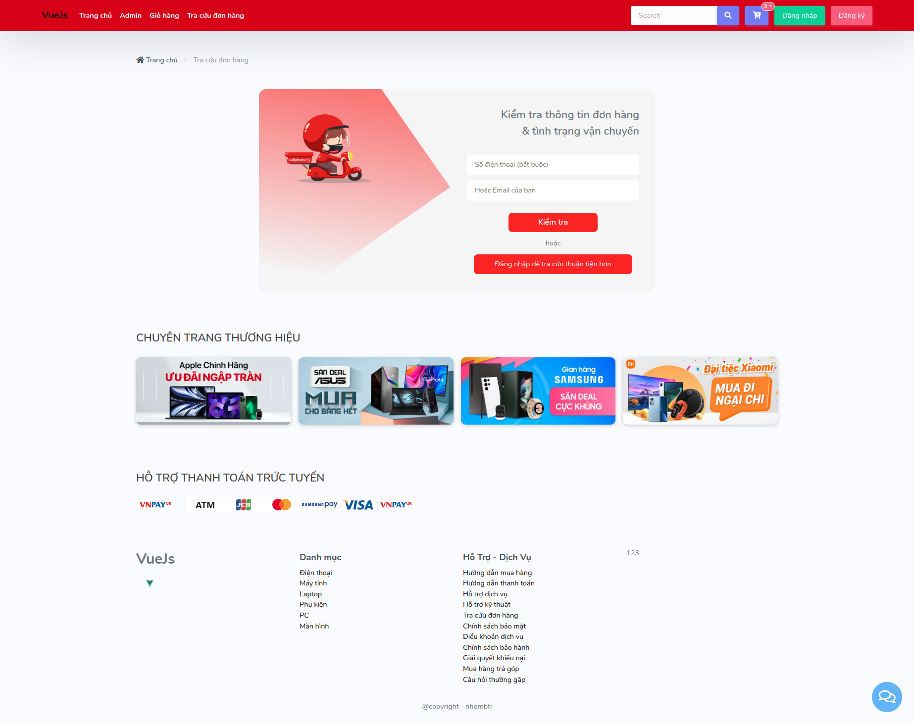

# vue-project

## Project Setup

```sh
npm install
```

### Compile and Hot-Reload for Development

```sh
npm run dev
```

### Compile and Minify for Production

```sh
npm run build
```

# laravel-project

```sh
php artisan migrate
php artisan db:seed
php artisan shop:cate
php artisan shop:product
```

# Display Screen





